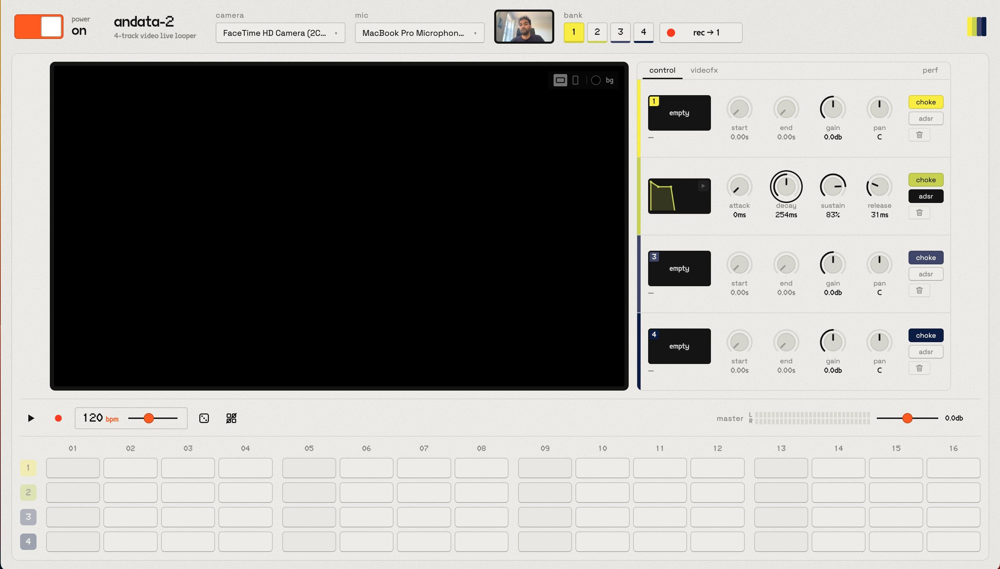

<p align="center">
  
</p>

<h1 align="center">andata-2</h1>
<p align="center">4-track video live looper</p>

<p align="center">
  
</p>

## What it does

andata-2 is a browser instrument for performing with short video loops. You record four clips from your camera and mic, then sequence them into a live audiovisual composition.

**Record → shape → sequence → perform → bounce**

1. **Record.** Pick a camera and mic, choose a bank (1–4) and record a clip into it. Video and audio are captured together and encoded to MP4 in the browser.
2. **Shape.** Each bank has its own controls:
   - **Audio:** trim, gain, pan, an ADSR envelope, and choke (whether a retrigger cuts or overlaps the previous hit).
   - **Video:** effects such as two-tone and crush (pixelate / bit depth).
3. **Sequence.** A 16-step sequencer triggers the banks in time. Rows can be muted, randomised or cleared, and tempo is set in BPM.
4. **Perform.** Banks that are playing are composited live onto the stage. One, two, three or four tiles split the frame, in horizontal (16:9) or vertical (9:16). Their audio is mixed through a master bus with a stereo meter.
5. **Bounce.** Record the composed stage, picture and sound, and it downloads as an MP4.

### How it fits together

```
camera + mic ──► capture (MP4) ──► clip per bank
                                         │
            sequencer clock ──► triggers ├─► voice: audio buffer → envelope → bank gain/pan ─► master ─► speakers
                                         │                                                      └──► bounce (MP4)
                                         └─► voice: decoded frames → bank video fx ─► stage compositor ─┘
```

- **One clock.** Everything is timed against the Web Audio clock. The sequencer schedules triggers slightly ahead, so audio is sample-accurate and video frames are pulled to match.
- **Banks and voices.** A bank holds a clip and its settings. Each trigger creates a short-lived *voice* that plays the trimmed clip. Choke decides whether a new voice releases the previous one.
- **Media in the browser.** Recording, decoding and bouncing use [mediabunny](https://github.com/Vanilagy/mediabunny) on top of WebCodecs. Nothing is uploaded anywhere.
- **Built to be measured.** The **perf** tab shows frame timing, scheduling headroom, decoders and memory, both globally and per bank.

## Dev notes

### Requirements

- Node.js 20+ and npm.
- A Chromium-based browser (Chrome, Edge, Arc). The app relies on WebCodecs for encoding and decoding; other browsers may lack some codecs.
- Camera and mic access only works on `localhost` or HTTPS.

### Run locally

```bash
npm install
npm run dev        # Vite dev server at http://localhost:5173
```

Open the app, flip the **power** switch on and allow camera and mic access. Use headphones while recording: mic processing is turned off for a clean signal, so speakers will bleed into new takes.

### Other scripts

```bash
npm run build      # type-check (tsc) and production build into dist/
npm run preview    # serve the production build
npm run lint       # oxlint
```

### Project layout

```
src/
  engine/        framework-free audio/video engine
    Engine.ts      audio graph, compositor loop, recording, perf snapshot
    Sequencer.ts   look-ahead step scheduler
    Bank.ts        per-bank state, gain/pan bus, voice management
    Voice.ts       one triggered playback (audio + frame-synced video)
    Clip.ts        loading/decoding a recorded clip
    capture.ts     camera/mic and stage → MP4 recording
    envelope.ts    ADSR maths
    fx.ts          video effects and tile drawing
    layout.ts      split-screen tile layouts
    perf.ts        performance counters
  components/    React UI (panels, knobs, sequencer, video fx, perf tab)
  App.tsx        wires UI state to the engine
```

The engine has no React dependencies. UI state lives in `App.tsx` and is pushed into the engine. The engine calls back only for the sequencer playhead.

### Stack

React + TypeScript + Vite · [mediabunny](https://github.com/Vanilagy/mediabunny) · Radix UI primitives · fonts: [VG5000](https://velvetyne.fr/fonts/vg5000/) (Velvetyne) and [Space Grotesk](https://fonts.google.com/specimen/Space+Grotesk), both SIL OFL.
